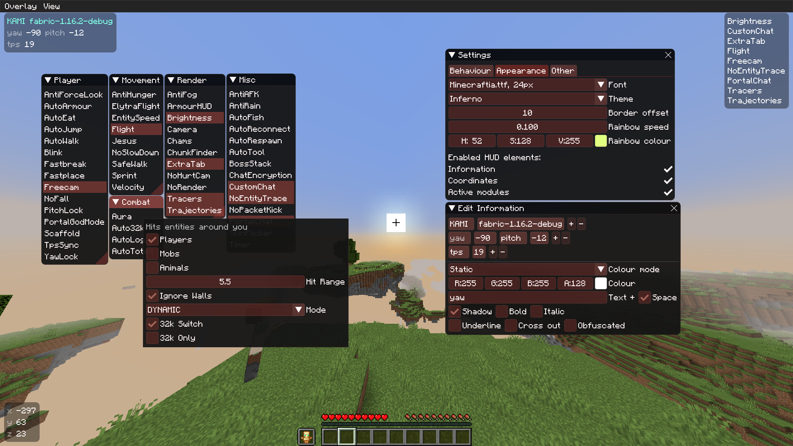
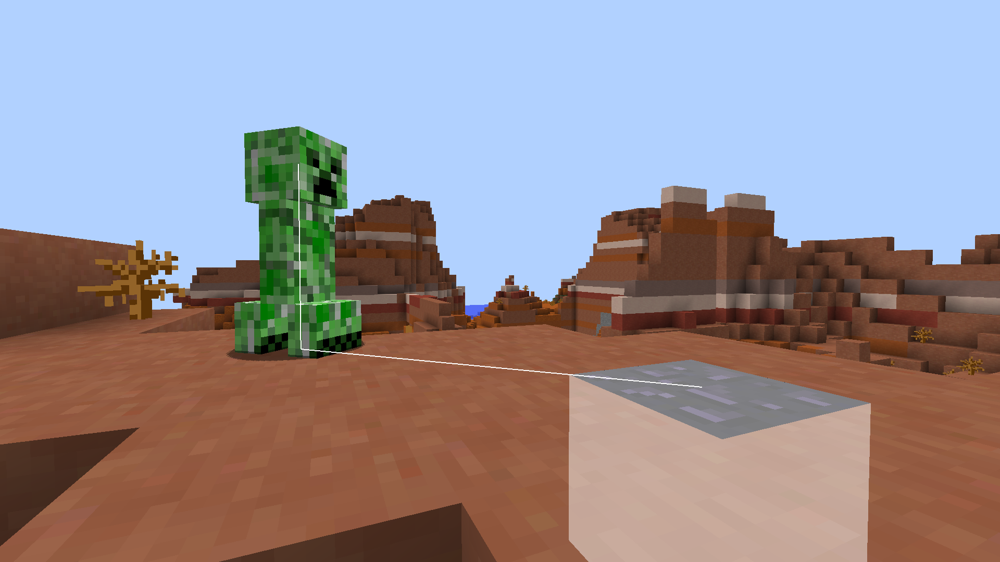

# KAMI

##### please note the current build status is based on the master branch, which won't be updated as often. I will replace this with my own or with a manual build status as soon as I can (05/10/19). 
[](https://travis-ci.com/zeroeightysix/KAMI)
[](https://github.com/zeroeightysix/kami/issues)
[](https://github.com/S-B99/kami/issues)
[](http://discord.gg/9hvwgeg)

A Minecraft utility mod for anarchy servers.

See [forgehax](https://github.com/fr1kin/forgehax) for a more polished equivalent. Some features in KAMI may be based on those of forgehax, as I sometimes used it as reference. Forgehax may also be missing some KAMI features. Client compatibility between these two should be fine, but please mention that you're using other clients if you do have an issue.

Please note Baritone is no longer included. Download the standalone jar [from here](https://github.com/cabaletta/baritone/releases).

This is by no means a finished project, nor is it a "cheat" or "hack" for anything, it is a *utility* mod.

## Status

This is currently in slowed development. Maintainance and further development is planned in the next couple months

## Preview

<details>
 <summary>Click to view images</summary>

 
 
 

</details>

## How do I

##### Open the GUI
Press Y.

##### Use commands
The default prefix is `.`. Commands are used through chat, use `.commands` for a list of commands.

##### Bind modules
Run `.bind <module> <key>`.

##### Change command prefix
By using the command `prefix <prefix>` without the `<>`(by default, `. <newprefix>`) or after having ran KAMI (make sure it's closed), editing your configuration file (find it using `config path` in-game) and changing the value of `commandPrefix` to change the prefix.

## Troubleshooting

Please reference the main [troubleshooting page](docs/TROUBLESHOOTING.md)

If you experience an issue and it's not listed there, please [open a new issue](../../issues/new) and a contributor will help you further.

## Installing

KAMI is a forge mod. Start by downloading the latest version of [1.12.2 forge](https://files.minecraftforge.net/).
1. Install forge
2. Navigate to your `.minecraft` directory.
   * **Windows**: `%appdata%/.minecraft`
   * **Linux**: `~/.minecraft`
3. Navigate to the `mods` directory. If it doesn't exist, create it.
4. Obtain the KAMI `.jar` file.
   * By **downloading** it: see [releases](../../releases)
   * By **building** it: see [building](#building).
5. Place the `.jar` file in your mods directory.

## Building
#### Windows

You can build by running these commands (without these <>) in a terminal with the current directory being KAMI. (EG. `cd C:\Users\Username\Downloads\KAMI`)
```
gradlew.bat <args>
```
Possible arguments on Windows are `build`.

To copy on windows run `autocopy.bat`

If you prefer copying it manually, find a file in `build/libs` called `KAMI-<minecraftVersion>-<kamiVersion>-**release**.jar` which you can copy to the `mods\1.12.2` folder of a minecraft instance that has forge installed.

Note: This assumes your minecraft folder is in the default location under your home folder.

#### Linux

You can build by running these commands (without these <>) in a terminal with the current directory being KAMI. (EG. `cd ~/Downloads/KAMI`)
```
./gradlew <args>
```
Possible arguments are `build`, `mkdir`, `rmOld` and `copy`, in that order. 

Build is required, mkdir makes the mods/1.12.2 directory, rmOld removes old versions of KAMI in that directory, and copy copies the build release to the mods/1.12.2 directory. 

If you prefer copying it manually, find a file in `build/libs` called `KAMI-<minecraftVersion>-<kamiVersion>-**release**.jar` which you can copy to the `mods/1.12.2` folder of a minecraft instance that has forge installed.

Note: This assumes your minecraft folder is in the default location under your home folder.

Note: Any argument other then `build` assumes you downloaded KAMI to a nested folder inside your home folder. For example `~/Downloads/KAMI` or `~/Documents/KAMI`

## Contributing

You are free to clone, modify KAMI and make pull requests as you wish. To set up your development environment, make use of the following commands:

```
git clone https://github.com/zeroeightysix/KAMI/
cd KAMI
```

On GNU/Linux, run `chmod +x gradlew` and for the following commands use `./gradlew` instead of `gradlew.bat`

Of-course you can also use a Gradle installation if you for some reason want another version of gradle

```
gradlew.bat setupDecompWorkspace
```
Import KAMI into your IDE of choice. If you use IntelliJ, import from the `build.gradle` file and run `gradlew.bat genIntellijRuns`

If you do not wish to run from an IDE, use `gradlew.bat runClient` to run KAMI.

## Thank you

[zeroeightysix](https://github.com/zeroeightysix) for the original [KAMI](https://github.com/zeroeightysix/KAMI)

[ZeroMemes](https://github.com/ZeroMemes) for [Alpine](https://github.com/ZeroMemes/Alpine)

[ronmamo](https://github.com/ronmamo/) for [Reflections](https://github.com/ronmamo/reflections)

The [minecraft forge team](https://github.com/MinecraftForge) for [forge](https://files.minecraftforge.net/)
