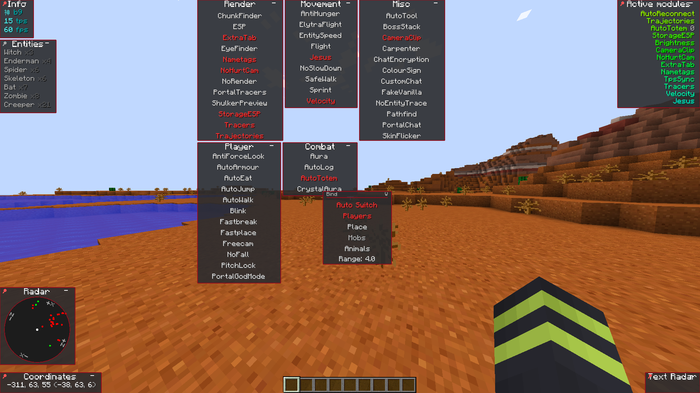

# KAMI
[](https://travis-ci.com/zeroeightysix/KAMI)
[](https://github.com/zeroeightysix/kami/issues)
[](http://discord.gg/9hvwgeg)

## A Minecraft utility mod for anarchy servers.

The Fabric 1.16.2 version is in active development.

## Preview

<details>
 <summary>Click to view images</summary>

 

 

</details>

## Installing

This branch currently has no releases, as it is in active development. 

Please see [building](#building) to build it yourself. 
Note that the latest commit may not always work. 

## How do I

##### Open the GUI
Press Y.

##### Use commands
The default prefix is `.`. Commands are used through chat, use `.commands` for a list of commands.

##### Bind modules
Run `.bind <module> <key>`.

##### Change command prefix
By using the command `prefix <prefix>` or after having ran KAMI (make sure it's closed), editing your configuration file (find it using `config path` in-game) and changing the value of `commandPrefix` to change the prefix.

## Troubleshooting
Please reference the main [troubleshooting page](docs/TROUBLESHOOTING.md)

To ask for help, join the [Discord](http://discord.gg/9hvwgeg)

If you experience an issue and it's not listed there, please [open a new issue](../../issues/new/choose) and a contributor will help you further.

## Contributing

You are free to clone, modify KAMI and make pull requests as you wish. To set up your development environment, make use of the following commands:

```
git clone -b fabric https://github.com/zeroeightysix/KAMI/
cd KAMI
```

On GNU/Linux, run `chmod +x gradlew` beforehand.

On Windows, for the following commands use `gradlew.bat` instead of `./gradlew`

Of-course you can also use a Gradle installation if you for some reason want another version of gradle

Import KAMI into your IDE of choice. 

If you use IntelliJ, import from the `build.gradle` file and run `./gradlew genIntellijRuns`

If you use Eclipse run `./gradlew eclipse`

If you do not wish to run from an IDE, use `./gradlew runClient` to run KAMI.

### Building
#### Linux
You can build by running these commands (without the <>) in a terminal.

```
git clone -b fabric https://github.com/zeroeightysix/KAMI/
cd KAMI

chmod +x gradlew
./gradlew <args>
```

Possible arguments:

```
build
mkdir
rmOld
copy
```

If you use more than one then it must be in that order. 

Build is required, `mkdir` makes the `mods/` directory, `rmOld` removes old versions of KAMI<sup>\[1]</sup> in that directory, and `copy` copies the build release to the `mods/` directory. 

<sup>\[1]</sup>`rmOld` removes any jars with the format `KAMI*-release.jar`, which is the format KAMI uses. If you use any other mod that uses that naming scheme please remove old versions manually.

If you prefer copying it manually, find a file in `build/libs` called `KAMI-<minecraftVersion>-<kamiVersion>-**release**.jar` which you can copy to the `mods/` folder of a Minecraft instance that has Fabric installed.

Note: This assumes your Minecraft folder is in the default location under your home folder.

#### Windows
You can build by running these commands in a terminal with the current directory being KAMI. (EG. `cd C:\Users\Username\Downloads\KAMI`)

```
gradlew.bat build
```

To copy on windows run `autocopy.bat`

If you prefer copying it manually, find a file in `build/libs` called `KAMI-<minecraftVersion>-<kamiVersion>-**release**.jar` which you can copy to the `mods\` folder of a Minecraft instance that has Fabric installed.

Note: This assumes your Minecraft folder is in the default location under your %appdata% folder.

## Thank you
[ZeroMemes](https://github.com/ZeroMemes) for [Alpine](https://github.com/ZeroMemes/Alpine)

[ronmamo](https://github.com/ronmamo/) for [Reflections](https://github.com/ronmamo/reflections)

The [Minecraft Forge team](https://github.com/MinecraftForge) for [Forge](https://files.minecraftforge.net/)

The [Fabric Team](https://github.com/FabricMC) for [Fabric](https://github.com/FabricMC/fabric-loader) and [Yarn](https://github.com/FabricMC/yarn)
